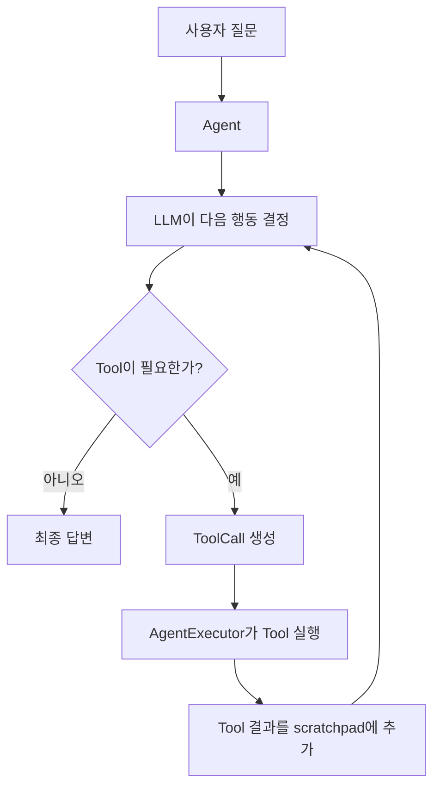

LLM이 어떤 Tool을 사용할지 판단하고, Tool을 실행하고, 결과를 다시 확인한 뒤 최종 답변을 만들도록 관리하는 실행 구조를 의미한다.

## Agent의 전체 흐름



예를 들어 사용자가 “시그니처 스테이크의 가격과 특징을 알려주고, 어울리는 와인도 추천해줘.” 라고 질문한 경우 Agent는 다음처럼 행동하게 된다.

1. `search_menu` Tool 호출
2. 메뉴 검색 결과 확인
3. `search_wine` Tool 호출
4. 와인 검색 결과 확인
5. 두 결과를 조합해서 최종 답변 생성

## 1. Agent Prompt의 역할 및 설계

```python
from langchain_core.prompts import (
    ChatPromptTemplate,
    MessagesPlaceholder,
)

agent_prompt = ChatPromptTemplate.from_messages(
    [
        (
            "system",
            """
            You are a restaurant information assistant.
            Use search_menu for restaurant menu information.
            Use wiki_summary for general food information.
            Use search_wine for wine recommendations.
            Use search_web for current information.
            """,
        ),
        MessagesPlaceholder(
            variable_name="chat_history",
            optional=True,
        ),
        ("human", "{input}"),
        MessagesPlaceholder(
            variable_name="agent_scratchpad",
        ),
    ]
)
```

### 1.1. system

- Agent의 기본 행동 규칙을 정의하는 곳이다.
	- 메뉴 정보는 `search_menu` 사용
	- 음식 역사나 일반 지식은 `wiki_summary` 사용
	- 와인 추천은 `search_wine` 사용
	- 최신 정보는 `search_web` 사용

참고로 위 프롬포트는 Agent에게 Tool 사용 기준을 알려주는 역할을 하지만, 위와 같은 prompt만으로 Tool 사용이 100% 보장되지는 않음.

### 1.2. chat_history

```python
MessagesPlaceholder(
    variable_name="chat_history",
    optional=True,
)
```

- 이전 대화 기록이 들어가는 자리다. Agent가 이전 대화를 참고할 수 있게 된다.
- 참고로 `optional=true`이므로 이전 대화 기록이 필수 입력값은 아니게 된다.

### 1.3. {input}

```python
("human", "{input}")
```

- 현재 사용자가 새로 입력한 질문이다.

참고로 뒤에서 다루지만 AgentExecutor를 실행할 때 변수명을(위 코드 기준으로는 `input`) 잘 통일해야 한다. 안 그러면 AgentExecutor에서 prompt에서 정의한 변수를 못 찾음.

### 1.4. agent_scratchpad (필수)

```python
MessagesPlaceholder(
    variable_name="agent_scratchpad",
)
```

- Agent가 현재 질문을 처리하면서 만든 중간 실행 기록이 들어가는 자리다.
	- `AIMessage`: search_menu를 호출하자.
	- `ToolMessage`: 시그니처 스테이크의 가격은 35,000원이다.
	- `AIMessage`: 이제 search_wine을 호출하자.
	- `ToolMessage`: 스테이크와 어울리는 와인은 Cabernet Sauvignon이다.

## 2. Agent / AgentExecutor 생성

### 2.1. Agent 생성

```python
from langchain.agents import (
    AgentExecutor,
    create_tool_calling_agent,
)

tools = [
    search_web,
    wiki_summary,
    search_wine,
    search_menu,
]

agent = create_tool_calling_agent(
    llm,
    tools,
    agent_prompt,
)
```

- `tools = []` : Agent가 사용할 수 있는 Tool 목록
	- Agent는 각 도구 안에 있는 설명을 보고 Tool의 사용 여부를 결정하게 된다.
- `create_tool_calling_agent`
	- 사용할 LLM
	- 사용할 Tool 목록
	- 이전에 작성한 Agent Prompt

### 2.2. AgentExecutor 생성

```python
agent_executor = AgentExecutor(
    agent=agent,
    tools=tools,
    verbose=True,
)
```

## 3. AgentExecutor 실행

```python
query = (
    "시그니처 스테이크의 가격과 특징은 무엇인가요? "
    "그리고 스테이크와 어울리는 와인 추천도 해주세요."
)

agent_response = agent_executor.invoke({
    "input": query
})
```

### 3.1. 사용자의 질문을 입력받는다.

```python
{
    "input": "시그니처 스테이크의 가격과 특징은 무엇인가요?"
}
```

- 이 값이 Prompt의 `{input}` 자리에 들어간다.

### 3.2. LLM이 Tool을 선택한다.

```python
{
    "name": "search_menu",
    "args": {
        "query": "시그니처 스테이크"
    },
    "id": "call_menu_123"
}
```

```python
{
    "name": "search_wine",
    "args": {
        "query": "스테이크와 어울리는 와인"
    },
    "id": "call_wine_456"
}
```

- LLM이 질문을 분석하고 ToolCall을 만들게 된다. 동시에 다음 Tool도 선택할 수도 있다.

### 3.3. AgentExecutor가 Tool 실행

```python
search_menu.invoke(tool_call)
search_wine.invoke(tool_call)
```

- `AgentExecutor`가 Tool 이름을 확인하고, 실제 함수를 실행한다.

### 3.4. Tool 결과를 scratchpad에 추가

```python
search_menu 결과:
시그니처 스테이크 가격 35,000원

search_wine 결과:
Cabernet Sauvignon 추천
```

- 이 결과가 `agent_scratchpad`를 통해 다시 LLM에게 전달되게 된다.

### 3.5. LLM의 최종 답변 생성 및 결과 반환

```python
{
    "input": "...",
    "output": "시그니처 스테이크는 ...",
}
```

## 4. 수동 체인과 에이전트의 차이점

수동 체인의 경우에는 개발자가 직접 ToolCall 확인하고 이름 비교하고, Tool을 실행해야 한다. 또한 Tool을 실행한 결과를 가지고 두 번째 LLM을 다시 호출했다. ([[Tool Calling 1]] 참고)

다만 에이전트는 이런 복잡한 반복 실행을 AgentExecutor가 대신 관리를 해준다. 수동 체인의 경우에는 주로 한 번의 흐름이 끝이지만, 에이전트는 결과를 보고 스스로 판단하여 여러 번 실행할 수 있다.