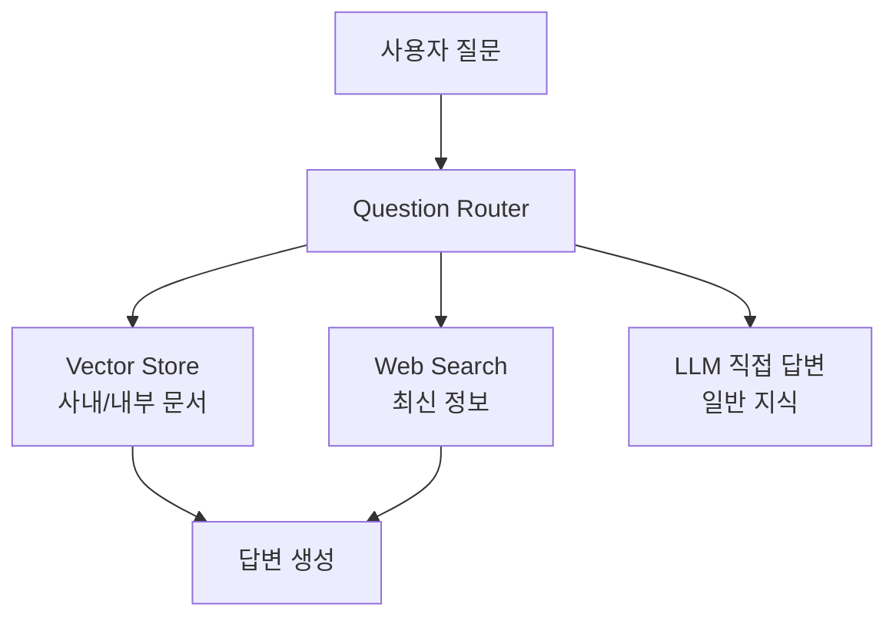
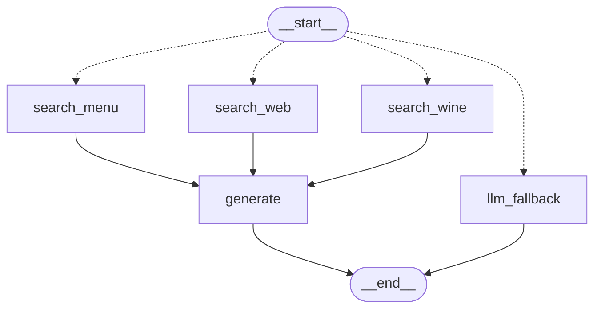

Adaptive RAG는 사용자의 질문을 분석해 가장 적합한 검색 및 생성 전략을 동적으로 선택하는 방법이다. 단순 질문의 경우에는 기본 LLM, 일반 질문의 경우에는 단일 단계 또는 검색 증강 LLM, 복잡한 질문에 대해서는 반복적 검색•추론 증강 LLM을 사용한다.

## Adaptive RAG 개념

```
질문 -> 문서 검색 -> 문서 LLM 전달 -> 답변
```

일반적인 RAG의 경우 위와 같은 흐름으로 항상 거의 동일한 파이프라인으로 움직인다. ([[Chroma로 RAG chain 구현]], [[StateGraph로 LLM 기반 조건부 라우팅 RAG 구현]] 참고)

반면 Adaptive RAG는 사용자의 질문을 분석해, 어떤 검색 방식과 데이터 소스를 사용할지 동적으로 판단하고 적절한 경로로 라우팅하는 RAG 방식이다.



Adaptive RAG의 성격을 가지는 보편적인 그래프다. 사용자에 질문에 따라 복잡성을 기준으로 라우팅을 하게 된다. Adaptive RAG는 질문 쿼리에 따라 경로을 선택하는 라우팅 전략이 핵심인 RAG 방법이다.

|일반 RAG|Adaptive RAG|
|---|---|
|항상 검색|검색 필요 여부 판단|
|하나의 Retriever|여러 데이터 소스 선택 가능|
|검색 결과 그대로 사용|검색 결과 품질 평가|
|고정 Pipeline|질문에 따라 Pipeline 변경|

## Adaptive RAG 구현

#### 그래프 상태 정의

```python
from typing import TypedDict, List
from langchain_core.documents import Document

# 상태 Schema 정의 
class AdaptiveRagState(TypedDict):
    question: str
    documents: List[Document]
    generation: str
```

#### 질문 분석 → Tool 결정

```python
from typing import Literal
from langchain_core.prompts import ChatPromptTemplate
from pydantic import BaseModel, Field

# 라우팅 결정을 위한 데이터 모델
class ToolSelector(BaseModel):
    """Routes the user question to the most appropriate tool."""
    tool: Literal["search_menu", "search_web", "search_wine"] = Field(
        description="Select one of the tools: search_menu, search_wine or search_web based on the user's question.",
    )

# 구조화된 출력을 위한 LLM 설정
structured_llm = llm.with_structured_output(ToolSelector)

# 라우팅을 위한 프롬프트 템플릿
system = dedent("""You are an AI assistant specializing in routing user questions to the appropriate tool.
Use the following guidelines:
- For questions about the restaurant's menu, use the search_menu tool.
- For wine recommendations or pairing information, use the search_wine tool.
- For any other information or the most up-to-date data, use the search_web tool.
Always choose the most appropriate tool based on the user's question.""")

route_prompt = ChatPromptTemplate.from_messages(
    [
        ("system", system),
        ("human", "{question}"),
    ]
)

# 질문 라우터 정의
question_router = route_prompt | structured_llm

# 테스트 실행
print(question_router.invoke({"question": "채식주의자를 위한 메뉴가 있나요?"}))
print(question_router.invoke({"question": "스테이크 메뉴와 어울리는 와인을 추천해주세요."}))
print(question_router.invoke({"question": "2022년 월드컵 우승 국가는 어디인가요?"}))

\#tool='search_menu'
\#tool='search_wine'
\#tool='search_web'
```

- `system`에서 도구별로 사용 목적이 있어서 LLM이 분석할 때 사용한다.

#### 결정된 Tool → 라우팅

```python
# 질문 라우팅 노드 
def route_question_adaptive(state: AdaptiveRagState) -> Literal["search_menu", "search_wine", "search_web", "llm_fallback"]:
    question = state["question"]
    try:
        result = question_router.invoke({"question": question})
        datasource = result.tool
        
        if datasource == "search_menu":
            return "search_menu"
        elif datasource == "search_wine":
            return "search_wine"        
        elif datasource == "search_web":
            return "search_web"
        else:
            return "llm_fallback"
    
    except Exception as e:
        print(f"Error in routing: {str(e)}")
        return "llm_fallback"
```

#### 검색 노드 설정

```python
def search_menu_adaptive(state: AdaptiveRagState):
    """
    Node for searching information in the restaurant menu
    """
    question = state["question"]
    docs = search_menu.invoke(question)
    if len(docs) > 0:
        return {"documents": docs}
    else:
        return {"documents": [Document(page_content="관련 메뉴 정보를 찾을 수 없습니다.")]}


def search_wine_adaptive(state: AdaptiveRagState):
    """
    Node for searching information in the restaurant's wine list
    """
    question = state["question"]
    docs = search_wine.invoke(question)
    if len(docs) > 0:
        return {"documents": docs}
    else:
        return {"documents": [Document(page_content="관련 와인 정보를 찾을 수 없습니다.")]}


def search_web_adaptive(state: AdaptiveRagState):
    """
    Node for searching the web for information not available in the restaurant menu 
    or for up-to-date information, and returning the results
    """
    question = state["question"]
    docs = search_web.invoke(question)
    if len(docs) > 0:
        return {"documents": docs}
    else:
        return {"documents": [Document(page_content="관련 정보를 찾을 수 없습니다.")]}
```

#### 답변 생성 노드 설정

```python
from langchain_core.output_parsers import StrOutputParser
from langchain_core.prompts import ChatPromptTemplate

# RAG 프롬프트 정의
rag_prompt = ChatPromptTemplate.from_messages([
    ("system", """You are an assistant answering questions based on provided documents. Follow these guidelines:

1. Use only information from the given documents.
2. If the document lacks relevant info, say "The provided documents don't contain information to answer this question."
3. Cite relevant parts of the document in your answers.
4. Don't speculate or add information not in the documents.
5. Keep answers concise and clear.
6. Omit irrelevant information."""
),
    ("human", "Answer the following question using these documents:\n\n[Documents]\n{documents}\n\n[Question]\n{question}"),
])

def generate_adaptive(state: AdaptiveRagState):
    """
    Generate answer using the retrieved_documents
    """
    question = state.get("question", None)
    documents = state.get("documents", [])
    if not isinstance(documents, list):
        documents = [documents]

    # 문서 내용을 문자열로 변환
    documents_text = "\n\n".join([f"---\n본문: {doc.page_content}\n메타데이터:{str(doc.metadata)}\n---" for doc in documents])

    # RAG generation
    rag_chain = rag_prompt | llm | StrOutputParser()
    generation = rag_chain.invoke({"documents": documents_text, "question": question})
    return {"generation": generation}
    

# LLM Fallback 프롬프트 정의
fallback_prompt = ChatPromptTemplate.from_messages([
    ("system", """You are an AI assistant helping with various topics. Follow these guidelines:

1. Provide accurate and helpful information to the best of your ability.
2. Express uncertainty when unsure; avoid speculation.
3. Keep answers concise yet informative.
4. Inform users they can ask for clarification if needed.
5. Respond ethically and constructively.
6. Mention reliable general sources when applicable."""),
    ("human", "{question}"),
])

def llm_fallback_adaptive(state: AdaptiveRagState):
    """
    Generate answer using the LLM without context
    """
    question = state.get("question", "")
    
    # LLM chain
    llm_chain = fallback_prompt | llm | StrOutputParser()
    
    generation = llm_chain.invoke({"question": question})
    return {"generation": generation}
```

#### 그래프 연결

```python
from langgraph.graph import StateGraph, START, END
from IPython.display import Image, display

# 그래프 구성
builder = StateGraph(AdaptiveRagState)

# 노드 추가
builder.add_node("search_menu", search_menu_adaptive)
builder.add_node("search_wine", search_wine_adaptive)
builder.add_node("search_web", search_web_adaptive)
builder.add_node("generate", generate_adaptive)
builder.add_node("llm_fallback", llm_fallback_adaptive)

# 엣지 추가
builder.add_conditional_edges(
    START,
    route_question_adaptive
)

builder.add_edge("search_menu", "generate")
builder.add_edge("search_wine", "generate")
builder.add_edge("search_web", "generate")
builder.add_edge("generate", END)
builder.add_edge("llm_fallback", END)

# 그래프 컴파일 
adaptive_rag = builder.compile()
```

## 최종 Adaptive RAG 모형

