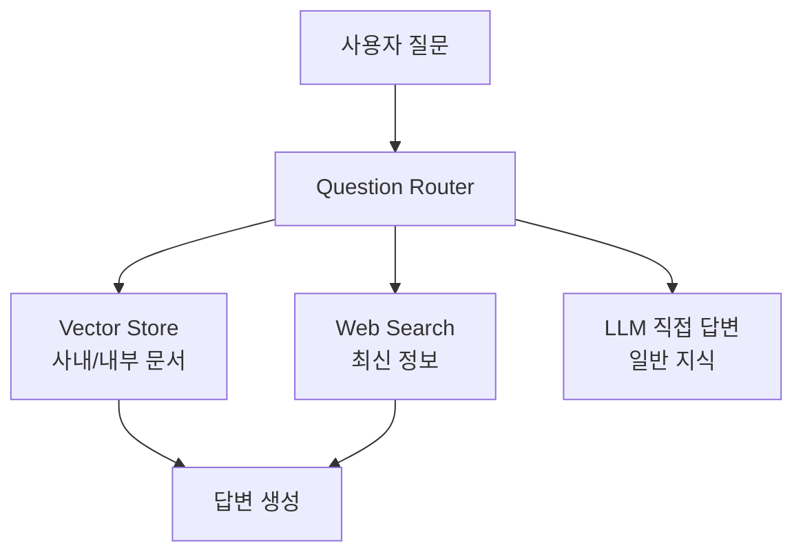

Adaptive RAG는 사용자의 질문을 분석해 가장 적합한 검색 및 생성 전략을 동적으로 선택하는 방법이다. 단순 질문의 경우에는 기본 LLM, 일반 질문의 경우에는 단일 단계 또는 검색 증강 LLM, 복잡한 질문에 대해서는 반복적 검색•추론 증강 LLM을 사용한다.

## Adaptive RAG 개념

```
질문 -> 문서 검색 -> 문서 LLM 전달 -> 답변
```

일반적인 RAG의 경우 위와 같은 흐름으로 항상 거의 동일한 파이프라인으로 움직인다. ([[StateGraph로 LLM 기반 조건부 라우팅 RAG 구현]] ← 참고)

반면 Adaptive RAG는 사용자의 질문을 분석해, 어떤 검색 방식과 데이터 소스를 사용할지 동적으로 판단하고 적절한 경로로 라우팅하는 RAG 방식이다.



Adaptive RAG의 성격을 가지는 보편적인 그래프다. 사용자에 질문에 따라 복잡성을 기준으로 라우팅을 하게 된다. Adaptive RAG는 질문 쿼리에 따라 경로을 선택하는 라우팅 전략이 핵심인 RAG 방법이다.

|일반 RAG|Adaptive RAG|
|---|---|
|항상 검색|검색 필요 여부 판단|
|하나의 Retriever|여러 데이터 소스 선택 가능|
|검색 결과 그대로 사용|검색 결과 품질 평가|
|고정 Pipeline|질문에 따라 Pipeline 변경|