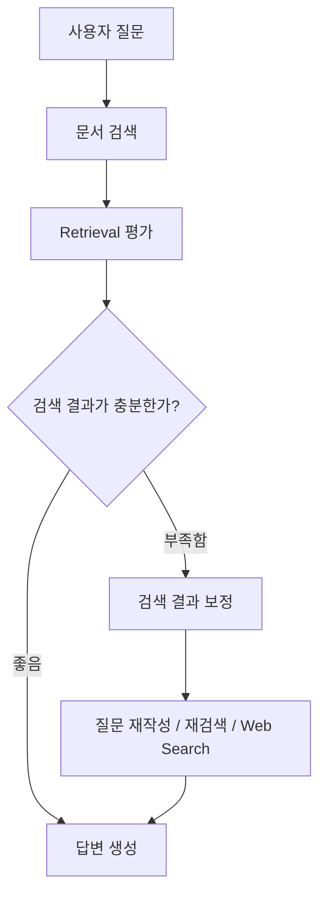

CRAG(Corrective RAG)는 초기 검색 결과를 그대로 사용하지 않고 지식 정제를 통해 결과의 품질을 평가한 뒤, 문제가 있으면 이를 보정하는 방식의 RAG 방법이다.보정은 재검색•질문 쿼리 재작성•외부 검색 등을 통해 보정한다.

## CRAG 알고리즘



### Retrieval 평가 기준

```
Correct
→ 검색 결과가 충분히 관련 있음
→ 기존 문서로 답변 생성

Incorrect
→ 검색 결과가 질문과 관련 없음
→ Web Search

Ambiguous
→ 일부 관련은 있지만 충분하지 않음
→ Query Rewrite 후 재검색 등
```

CRAG에서는 3가지 평가 방식을 가지게 된다. 이 평가 결과에 따라서 다음 행동이 달라진다. 이때 가져온 문서에 대해 그대로 평가하지 않고, 해당 문서에 대해 핵심 정보만 정제를 한 뒤에 그 핵심 정보가 질문을 답변하기 위해 충분한지에 대해 평가하게 된다.

### Correction(보정) 방법들

```
- 관련 없는 문서 제거
- Query Rewrite
- Vector DB 재검색
- 검색 범위 확대
- 다른 Retriever 사용
- Web Search
- 여러 검색 결과 결합
```

검색 결과를 보정하기 위해 여러가지 방법을 사용할 수 있다. Correction은 단순한 웹 검색 등이 아닌 Retrieval 실패를 복구하기 위한 전략이다.

## Self-RAG, Adaptive RAG와 차이

- **Adaptive RAG**
	- 분석 결과에 따라 어떤 검색 전략/경로를 사용할까?
- **Self-RAG**
	- 검색 결과와 생성된 답변이 제대로 만들어 졌나?
- **CRAG**
	- 검색 결과가 안 좋으면 어떻게 고칠까? (평가 → 대처)

[[Adaptive RAG]]와 [[Self-RAG]]의 성격을 합친 것이 CRAG 방식과 유사하다. 처음에 검색한 것들에 대해 지식 정제를 한 뒤에 평가(Self-RAG 핵심)를 하고, 그 평가 결과에 따라서 라우팅(Adaptive 핵심)을 담당하는 것이 꼭 Self-RAG → Adaptive RAG 방식으로 흘러가는 것처럼 느껴졌다.

한 줄 요약을 하면 Self-Reflection과 Adaptive Routing 메커니즘을 활용해서 Retrieval 오류를 보정하는 CRAG를 구현할 수 있다고 정리할 수 있을 거 같다.