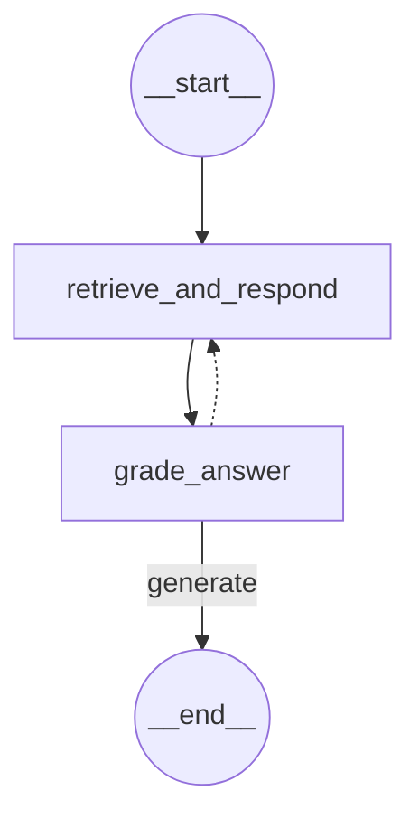

`MessagesState`와 `StateGraph`를 활용해서 Feedback Loop를 이해해 보자.

## 1. RAG 수행 후 결과를 State에 반영하는 Node

```python
# RAG 수행 함수 정의
def retrieve_and_respond(state: GraphState):
    last_human_message = state['messages'][-1]
    
    # HumanMessage 객체의 content 속성에 접근
    query = last_human_message.content
    
    # 문서 검색
    retrieved_docs = retriever.invoke(query)
    
    # 응답 생성
    response = rag_chain.invoke(query)
    
    # 검색된 문서와 응답을 상태에 저장
    return {
        "messages": [AIMessage(content=response)],
        "documents": retrieved_docs
    }
```

- `state['messages'][-1]`
	- 현재 State에서 사용자의 질문을 꺼낸다. (메시지 배열에 가장 늦게 저장된 메시지)
- `"messages": [AIMessage(content=response)]`
	- `messages`는 메시지 객체 배열이기 때문에 `AIMessage` 객체로 감싸둔다.
	- 만약에 `response`로 저장하면 LLM은 누구의 메시지인지 구분 못 한다.
	- Reducer가 누적 형식이기 때문에 배열에 추가가 된다. (덮어쓰기 X)

## 2. RAG 답변 평가 Node

```python
from pydantic import BaseModel, Field

# LLM의 답변 반환 형식 지정 (Pydantic 모델)
class GradeResponse(BaseModel):
    "A score for answers"
    score: float = Field(..., ge=0, le=1, description="A score from 0 to 1, where 1 is perfect")
    explanation: str = Field(..., description="An explanation for the given score")

# 답변 품질 평가 함수
def grade_answer(state: GraphState):
    messages = state['messages']
    question = messages[-2].content
    answer = messages[-1].content
    context = format_docs(state['documents'])

    grading_system = """You are an expert grader. 
    Grade the following answer based on its relevance and accuracy to the question, considering the given context. 
    Provide a score from 0 to 1, where 1 is perfect, along with an explanation."""

    grading_prompt = ChatPromptTemplate.from_messages([
        ("system", grading_system),
        ("human", "[Question]\n{question}\n\n[Context]\n{context}\n\n[Answer]\n{answer}\n\n[Grade]\n")
    ])
    
    grading_chain = grading_prompt | llm.with_structured_output(schema=GradeResponse)
    
    grade_response = grading_chain.invoke({
        "question": question,
        "context": context,
        "answer": answer
    })

    # 답변 생성 횟수를 증가 
    num_generation = state.get('num_generation', 0)
    num_generation += 1
    
    return {"grade": grade_response.score, "num_generation": num_generation}
```

- 사용자의 질문과, AI 답변을 가지고 답변을 평가시킨다.
	- `messages[-2]` = `HumanMessage` (사용자 질문)
	- `messages[-1]` = `AIMessges` (`HumanMessage`에 대한 AI의 답변)

## 3. 조건부 Edge에서 사용할 라우터 구현

```python
from typing import Literal

def should_retry(state: GraphState) -> Literal["retrieve_and_respond", "generate"]:
    print("----GRADTING---")
    print("Grade Score: ", state["grade"])

    # 답변 생성 횟수가 3회 이상이면 "generate"를 반환
    if state["num_generation"] > 2: 
        return "generate"    
    
    # 답변 품질 평가점수가 0.7 미만이면 RAG 체인을 다시 실행 
    if state["grade"] < 0.7:  
        return "retrieve_and_respond"
    else:
        return "generate"
```

- 평가 점수에 따라 다시 chain을 순환할 수 있다. → 이게 Feeeback Loop다.

다만 `retrieve_and_respond`에서 `messages[-1]`가 `HumanMessage`라고 하드코딩을 했기 때문에 이대로 피드백 루프가 돌아가면 문제가 생기게 된다.

따라서 이번 정리에서는 `MessagesState + StateGraph` 로 `messages` 필드를 쉽게 추가할 수 있으면서 메시지 기록 관리가 편하고, `MessageGraph`와 달리 확장이 가능하다는 것에 중점을 두도록 하자.

## 4. Feedback Loop Graph 구현

```python
# 그래프 설정
builder = StateGraph(GraphState)
builder.add_node("retrieve_and_respond", retrieve_and_respond)
builder.add_node("grade_answer", grade_answer)

builder.add_edge(START, "retrieve_and_respond")
builder.add_edge("retrieve_and_respond", "grade_answer")
builder.add_conditional_edges(
    "grade_answer",
    should_retry,
    {
        "retrieve_and_respond": "retrieve_and_respond",
        "generate": END
    }
)

# 그래프 컴파일
graph = builder.compile()

# 그래프 시각화
display(Image(graph.get_graph().draw_mermaid_png()))
```



## 5. 그래프 실행

```python
# 초기 상태
initial_state = {
    "messages": [HumanMessage(content="채식주의자를 위한 메뉴를 추천해주세요.")],
}

# 그래프 실행 
final_state = graph.invoke(initial_state)

# 최종 상태 출력
print("최종 상태:", final_state)

# ----GRADTING---
# Grade Score:  1.0
# 최종 상태: {'messages': [HumanMessage(content='채식주의자를 위한 메뉴를 추천해주세요.', additional_kwargs={}, response_metadata={}, id='2aee9ce3-7511-422a-913c-805aca651005'), AIMessage(content="채식주의자를 위한 메뉴로는 '가든 샐러드'를 추천합니다. 이 샐러드는 유기농 믹스 그린, 체리 토마토, 오이, 당근 등 신선한 채소들로 구성되어 있으며, 발사믹 드레싱이 채소의 맛을 살려줍니다. 건강하고 아삭한 식감을 즐길 수 있는 메뉴입니다. 가격은 ₩12,000입니다.", additional_kwargs={}, response_metadata={}, id='1c1cf75b-26b9-4879-9108-64135b3c3535')], 'documents': [Document(metadata={'menu_name': '가든 샐러드', 'menu_number': 5, 'source': './data/restaurant_menu.txt'}, page_content='5. 가든 샐러드\n   • 가격: ₩12,000\n   • 주요 식재료: 유기농 믹스 그린, 체리 토마토, 오이, 당근, 발사믹 드레싱\n   • 설명: 신선한 유기농 채소들로 구성된 건강한 샐러드입니다. 아삭한 식감의 믹스 그린에 달콤한 체리 토마토, 오이, 당근을 더해 다양한 맛과 식감을 즐길 수 있습니다. 특제 발사믹 드레싱이 채소 본연의 맛을 살려줍니다.'), Document(metadata={'menu_name': '해산물 파스타', 'menu_number': 6, 'source': './data/restaurant_menu.txt'}, page_content='6. 해산물 파스타\n   • 가격: ₩24,000\n   • 주요 식재료: 링귀네 파스타, 새우, 홍합, 오징어, 토마토 소스\n   • 설명: 알 덴테로 삶은 링귀네 파스타에 신선한 해산물을 듬뿍 올린 메뉴입니다. 토마토 소스의 산미와 해산물의 감칠맛이 조화를 이루며, 마늘과 올리브 오일로 풍미를 더했습니다. 파슬리를 뿌려 향긋한 맛을 더합니다.')], 'grade': 1.0, 'num_generation': 1}
```

```python
# 최종 답변만 출력
pprint(final_state['messages'][-1].content) 

# ("채식주의자를 위한 메뉴로는 '가든 샐러드'를 추천합니다. 이 샐러드는 유기농 믹스 그린, 체리 토마토, 오이, 당근 등 신선한 채소들로 "'구성되어 있으며, 발사믹 드레싱이 채소의 맛을 살려줍니다. 건강하고 아삭한 식감을 즐길 수 있는 메뉴입니다. 가격은 ₩12,000입니다.')
```

## 참고

[[StateGraph]]

[[MessagesState]]

[[MessageGraph]]