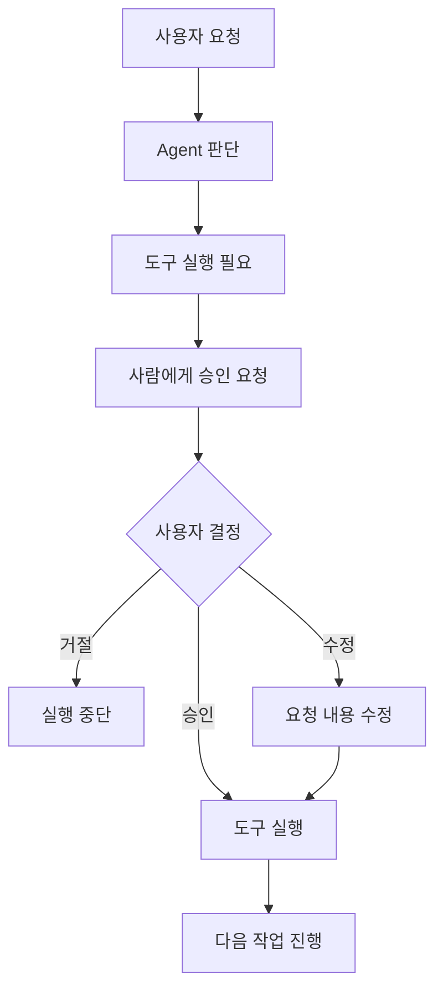
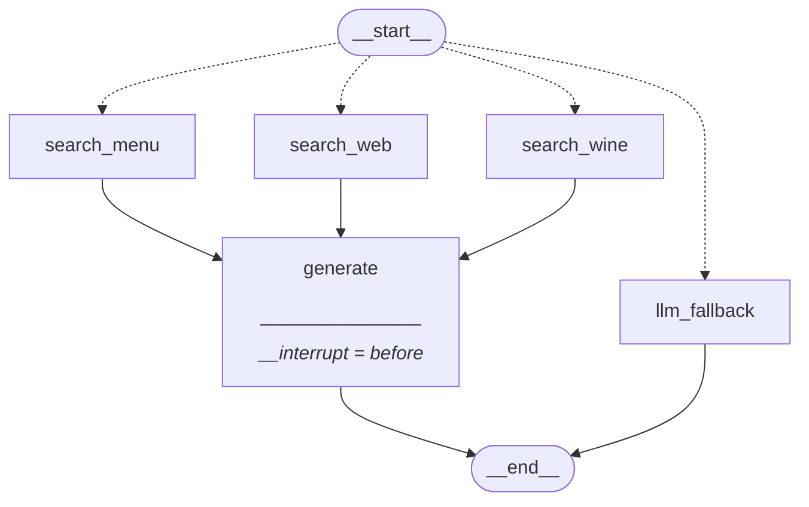

HITL는 AI•Agent의 실행 과정 중간에 사람이 개입해서 확인•수정•승인할 수 있도록 만드는 방식이다. 즉 Agent가 직접 모든 작업을 자동으로 끝내는 것이 아니라 AI가 판단하고, 사람이 확인하고 승인되면 계속 실행되는 구조다.

## 1. HITL의 흐름



예를 들어 AI Agent에게 내 일정에 대해 필요 없는 회의를 취소해달라고 요청했다고 가정하자. 자동 Agent의 경우에는 사용자의 허락 없이 일정을 삭제하겠지만, HITL를 적용하면 삭제할 일정에 대해 사용자에게 사전에 삭제 승인을 받도록 구현이 가능하다.

## 2. 사람에게 주로 맡기는 것들

### 2.1. Approve - 승인

```
Agent:
"회의 A를 삭제하려고 합니다."

Human:
승인

→ delete_event 실행
```

### 2.2. Reject - 거절

```
Agent:
"회의 A를 삭제하려고 합니다."

Human:
거절

→ 실행하지 않음
```

### 2.3. Edit - 수정

```
Agent:
"14시에 팀 회의를 등록하겠습니다."

Human:
"15시로 바꿔줘."

→ 수정된 값으로 실행
```

HITL를 단순히 승인 버튼이 아니라, AI의 판단을 사람이 검토하고 수정할 수 있는 제어 지점이라고 보는 것이 마땅하다.

## 3. LangGraph에서의 HITL 구현

[[Adaptive RAG]]에서 구현한 그래프에다가 HITL를 추가해 보자.

```python
from langgraph.checkpoint.memory import MemorySaver

# 체크포인트 설정
memory = MemorySaver()

# 컴파일 - 'generate' 노드 전에 중단점 추가
adaptive_rag_hitl = builder.compile(checkpointer=memory, interrupt_before=["generate"])

# 그래프 출력
display(Image(adaptive_rag_hitl.get_graph().draw_mermaid_png()))
```

LangGraph의 BrackPoints를 활용해서 그래프 실행을 특정 단계에서 중지할 수 있는데, 이는 LangGraph의 체크포인트 시스템을 기반으로 구현한다. 이전에 다룬 [[MemorySaver]]와 연결되는 개념이다.



기존 Adaptive RAG 모형에서 생성 노드에 중단점이 생기게 된다.

```python
# 도구 사용 전 중단점에서 실행을 멈춤 
thread = {"configurable": {"thread_id": "breakpoint_test"}}
# 그래프 초기 입력 쿼리
inputs = {"question": "스테이크 메뉴의 가격은 얼마인가요?"}
# stream()으로 그래프 실행
for event in adaptive_rag_hitl.stream(inputs, config=thread):
    for k, v in event.items():
        # '__end__' 이벤트는 미출력
        if k != "__end__":
            print(f"{k}: {v}")  # 이벤트의 키와 값을 함께 출력
# search_menu: {'documents': [Document(metadata={'menu_name': '시그니처 스테이크', 'menu_number': 1, 'source': './data/restaurant_menu.txt'}, page_content='1. 시그니처 스테이크\n   • 가격: ₩35,000\n   • 주요 식재료: 최상급 한우 등심, 로즈메리 감자, 그릴드 아스파라거스\n   • 설명: 셰프의 특제 시그니처 메뉴로, 21일간 건조 숙성한 최상급 한우 등심을 사용합니다. 미디엄 레어로 조리하여 육즙을 최대한 보존하며, 로즈메리 향의 감자와 아삭한 그릴드 아스파라거스가 곁들여집니다. 레드와인 소스와 함께 제공되어 풍부한 맛을 더합니다.'), Document(metadata={'menu_name': '안심 스테이크 샐러드', 'menu_number': 8, 'source': './data/restaurant_menu.txt'}, page_content='8. 안심 스테이크 샐러드\n   • 가격: ₩26,000\n   • 주요 식재료: 소고기 안심, 루꼴라, 체리 토마토, 발사믹 글레이즈\n   • 설명: 부드러운 안심 스테이크를 얇게 슬라이스하여 신선한 루꼴라 위에 올린 메인 요리 샐러드입니다. 체리 토마토와 파마산 치즈 플레이크로 풍미를 더하고, 발사믹 글레이즈로 마무리하여 고기의 풍미를 한층 끌어올렸습니다.')]}
```

- `.invoke()` 대신 `.stream()`을 사용하면 각 노드의 실행 결과를 이벤트 단위로 확인할 수 있다.
- 현재 입력 쿼리는 라우팅 결과 `search_menu` 노드로 전달되었고, 해당 노드의 검색 결과가 출력된 것을 확인할 수 있다.
- 이후 `generate` 노드로 넘어가야 하지만, `interrupt_before`가 설정되어 있어 `generate` 실행 직전에 그래프가 중단된다.

```python
adaptive_rag_hitl.update_state(
    thread,
    {"question": "매콤한 해산물 요리가 있나요?"}
)
```

- 이렇게 State를 수정한 뒤 그래프를 재개하면, 수정된 값을 기준으로 이후 실행을 이어갈 수 있다.

```python
# 입력값을 None으로 지정하면 중단점부터 실행하고 최종 답변을 생성 
for event in adaptive_rag_hitl.stream(None, config=thread):
    for k, v in event.items():
        # '__end__' 이벤트는 미출력
        if k != "__end__":
            print(f"{k}: {v}")  # 이벤트의 키와 값을 함께 출력

# [최종 답변]
# generate: {'generation': "The provided documents don't contain information to answer this question."}

# 만약에 중간에 HITL에서 질문 수정을 하지 않았다면 아래와 같은 답변이 출력
# generate: {'generation': '스테이크 메뉴의 가격은 다음과 같습니다:\n\n1. 시그니처 스테이크: ₩35,000\n2. 안심 스테이크 샐러드: ₩26,000'}
```

- `None`은 새로운 입력으로 시작하거나 업데이트하지 말고, 해당 `thread_id`에 저장되어 있던 기존의 체크포인트에서 계속 시작하라는 의미를 가진다.
- 이번에도 `.stream()`을 통해 실행 노드들을 차례로 볼 수 있는데, 이번에는 `generate` 노드가 실행된 것을 확인할 수 있다.