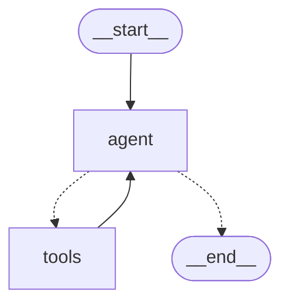

LangGraph에 내장되어 있는 ReAct 에이전트를 사용해 보자. 이미 만들어진 ReAct 에이전트를 제공하기 때문에 별도의 구현 없이 바로 사용할 수 있다는 장점이 있다.

## 1. Graph 생성

```python
from IPython.display import Image, display
from langgraph.prebuilt import create_react_agent

# 시스템 프롬프트
system_prompt = dedent("""
You are an AI assistant designed to answer human questions. 
You can use the provided tools to help generate your responses.
~~.. 이하 생략
"""

# ReAct 에이전트 그래프 생성
graph = create_react_agent(
    llm, 
    tools=tools, 
    state_modifier=system_prompt
)

# 그래프 출력
display(Image(graph.get_graph().draw_mermaid_png()))
```



- Agent에서 사용할 LLM과 사용 가능한 도구를 인자로 넣어줘야 한다.
	- 시스템 프롬포트도 넣을 수 있다. (필수는 아님)
- [[Feedback Loop Chain 1]] 구조를 통해 [[ReAct]] 방식을 구현했다.
	- `create_react_agent`를 통해 그래프를 쉽게 만들 수 있다.
	- 자동으로 위와 같은 구조의 그래프를 생성해 준다.

## 2. Graph 실행

```python
# 그래프 실행
inputs = {"messages": [HumanMessage(content="스테이크 메뉴의 가격은 얼마인가요?")]}
messages = graph.invoke(inputs)
for m in messages['messages']:
    m.pretty_print()
```

```
================================ Human Message =================================

스테이크 메뉴의 가격은 얼마인가요?
================================== Ai Message ==================================
Tool Calls:
  search_menu (call_Crek1if2ptiFjxl2nEeJYwvx)
 Call ID: call_Crek1if2ptiFjxl2nEeJYwvx
  Args:
    query: 스테이크
================================= Tool Message =================================
Name: search_menu

<Document source="./data/restaurant_menu.txt"/>
1. 시그니처 스테이크
   • 가격: ₩35,000
   • 주요 식재료: 최상급 한우 등심, 로즈메리 감자, 그릴드 아스파라거스
   • 설명: 셰프의 특제 시그니처 메뉴로, 21일간 건조 숙성한 최상급 한우 등심을 사용합니다. 미디엄 레어로 조리하여 육즙을 최대한 보존하며, 로즈메리 향의 감자와 아삭한 그릴드 아스파라거스가 곁들여집니다. 레드와인 소스와 함께 제공되어 풍부한 맛을 더합니다.
</Document>

---

<Document source="./data/restaurant_menu.txt"/>
8. 안심 스테이크 샐러드
   • 가격: ₩26,000
   • 주요 식재료: 소고기 안심, 루꼴라, 체리 토마토, 발사믹 글레이즈
...
   - 주요 식재료: 소고기 안심, 루꼴라, 체리 토마토, 발사믹 글레이즈
   - 설명: 부드러운 안심 스테이크를 얇게 슬라이스하여 신선한 루꼴라 위에 올린 샐러드입니다.

이 정보는 레스토랑 메뉴에서 확인한 내용입니다. [Source: search_menu | 스테이크 | ./data/restaurant_menu.txt]
Output is truncated. View as a scrollable element or open in a text editor. Adjust cell output settings...
```

다만 이미 구조가 만들어져 있기 때문에 `create_react_agent()`를 사용하는 경우에는 기본적인 그래프 뼈대 자체를 마음대로 바꿀 수는 없다. 그래서 이러한 ReAct Agent 구조의 그래프를 직접 구현할 수 있어야 한다.