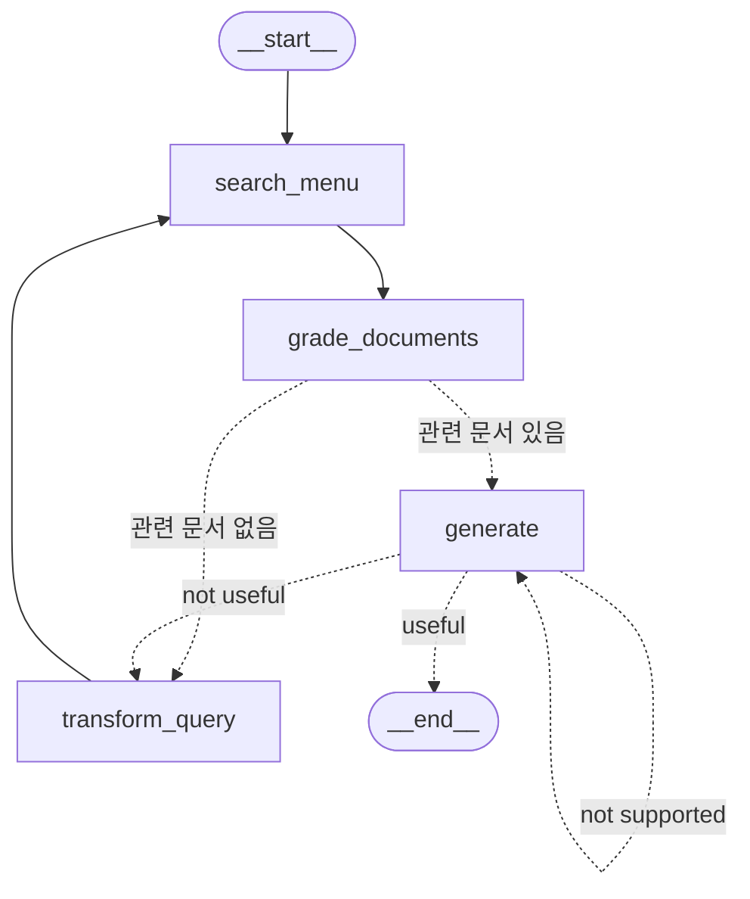

Self-RAG는 LLM이 단순히 검색하고 답변하는 수준이 아니라, 검색이 필요한지 판단하고 → 검색된 문서가 적절한지 평가하고 → 생성된 답변이 근거에 맞는지 스스로 검증하는 RAG 방식을 의미한다. 즉 검색부터 답변 생성까지 스스로 판단하고 평가하면서 진행되는 RAG 방식이다.

## 1. Self-RAG 원리 요약

```
Document 1
→ 질문과 관련 있음 ✅

Document 2
→ 질문과 관련 없음 ❌
```

- Self-RAG에서는 일반적인 RAG와 다르게 검색 문서의 관련성을 평가할 수 있다.
- 문서 뿐만 아니라 생성된 답변도 스스로 적합성에 대해 판단 가능하다.


- 중간중간 결과를 스스로 평가해서 [[Feedback Loop Chain]]을 돈다.

## 2. Self-RAG 구현 (1) - 필요한 데이터 모델 정의하기

### 2.1. Retrieval Grader (질문 ↔ 문서)

```python
from langchain_core.prompts import ChatPromptTemplate
from pydantic import BaseModel, Field
from langchain_openai import ChatOpenAI

# 검색된 문서의 관련성 평가 결과를 위한 데이터 모델 정의
class BinaryGradeDocuments(BaseModel):
    """Binary score for relevance check on retrieved documents."""

    binary_score: str = Field(
        description="Documents are relevant to the question, 'yes' or 'no'"
    )

# LLM 모델 초기화 및 구조화된 출력 설정
llm = ChatOpenAI(model="gpt-4o-mini", temperature=0)
structured_llm_grader = llm.with_structured_output(BinaryGradeDocuments)

# 문서 관련성 평가를 위한 시스템 프롬프트 정의
system_prompt = """You are an expert in evaluating the relevance of search results to user queries.

[Evaluation criteria]
1. 키워드 관련성: 문서가 질문의 주요 단어나 유사어를 포함하는지 확인
2. 의미적 관련성: 문서의 전반적인 주제가 질문의 의도와 일치하는지 평가
3. 부분 관련성: 질문의 일부를 다루거나 맥락 정보를 제공하는 문서도 고려
4. 답변 가능성: 직접적인 답이 아니더라도 답변 형성에 도움될 정보 포함 여부 평가

[Scoring]
- Rate 'yes' if relevant, 'no' if not
- Default to 'no' when uncertain

[Key points]
- Consider the full context of the query, not just word matching
- Rate as relevant if useful information is present, even if not a complete answer

Your evaluation is crucial for improving information retrieval systems. Provide balanced assessments."""

# 채점 프롬프트 템플릿 생성
grade_prompt = ChatPromptTemplate.from_messages([
    ("system", system_prompt),
    ("human", "[Retrieved document]\n{document}\n\n[User question]\n{question}"),
])

# Retrieval Grader 파이프라인 구성
retrieval_grader_binary = grade_prompt | structured_llm_grader
    
# 관련성 평가 실행
question = "대표 메뉴는 무엇인가요?"
retrieved_docs = menu_db.similarity_search(question, k=2)
print(f"검색된 문서 수: {len(retrieved_docs)}")
print("===============================================================================")
print()


relevant_docs = []

for doc in retrieved_docs:
    print("문서:", doc.page_content)
    print("---------------------------------------------------------------------------")

    relevance = retrieval_grader_binary.invoke({"question": question, "document": doc})
    print(f"문서 관련성: {relevance}")

    if relevance.binary_score == 'yes':
        relevant_docs.append(doc)
    
    print("===========================================================================")

# 검색된 문서 수: 2
# ===============================================================================
#
# 문서: 1. 시그니처 스테이크
#    • 가격: ₩35,000
#    • 주요 식재료: 최상급 한우 등심, 로즈메리 감자, 그릴드 아스파라거스
#    • 설명: 셰프의 특제 시그니처 메뉴로, 21일간 건조 숙성한 최상급 한우 등심을 사용합니다. 미디엄 레어로 조리하여 육즙을 최대한 보존하며, 로즈메리 향의 감자와 아삭한 그릴드 아스파라거스가 곁들여집니다. 레드와인 소스와 함께 제공되어 풍부한 맛을 더합니다.
# ---------------------------------------------------------------------------
# 문서 관련성: binary_score='yes'
# ===========================================================================
# 문서: 6. 해산물 파스타
#    • 가격: ₩24,000
#    • 주요 식재료: 링귀네 파스타, 새우, 홍합, 오징어, 토마토 소스
#    • 설명: 알 덴테로 삶은 링귀네 파스타에 신선한 해산물을 듬뿍 올린 메뉴입니다. 토마토 소스의 산미와 해산물의 감칠맛이 조화를 이루며, 마늘과 올리브 오일로 풍미를 더했습니다. 파슬리를 뿌려 향긋한 맛을 더합니다.
# ---------------------------------------------------------------------------
# 문서 관련성: binary_score='no'
# ===========================================================================
```

- 검색된 문서와 사용자의 질문이 관련 있다고 판단되는 문서만 필터링하는 코드다.

### 2.2 Answer Generator (답변 생성)

```python
# 기본 RAG 체인
from langchain_core.output_parsers import StrOutputParser

def generator_rag_answer(question, docs):

    template = """
    Answer the question based solely on the given context. Do not use any external information or knowledge.

    [Instructions]
        1. 질문과 관련된 정보를 문맥에서 신중하게 확인합니다.
        2. 답변에 질문과 직접 관련된 정보만 사용합니다.
        3. 문맥에 명시되지 않은 내용에 대해 추측하지 않습니다.
        4. 불필요한 정보를 피하고, 답변을 간결하고 명확하게 작성합니다.
        5. 문맥에서 답을 찾을 수 없으면 "주어진 정보만으로는 답할 수 없습니다."라고 답변합니다.
        6. 적절한 경우 문맥에서 직접 인용하며, 따옴표를 사용합니다.

    [Context]
    {context}

    [Question]
    {question}

    [Answer]
    """

    prompt = ChatPromptTemplate.from_template(template)
    llm = ChatOpenAI(model='gpt-4o-mini', temperature=0)    

    def format_docs(docs):
        return "\n\n".join([d.page_content for d in docs])
    
    rag_chain = prompt | llm | StrOutputParser()
    
    generation = rag_chain.invoke({"context": format_docs(docs), "question": question})

    return generation


# 관련성 평가를 통과한 문서를 기반으로 질문에 대한 답변 생성
generation = generator_rag_answer(question, docs=relevant_docs)
print(generation) # 대표 메뉴는 "시그니처 스테이크"입니다.
```

- 앞에 Retrieval Grader를 통과한 `relevant_docs`만 가지고 답변을 생성한다.

### 2.3. Hallucination Grader (문서 ↔ 답변)

```python
# 환각(Hallucination) 평가 결과를 위한 데이터 모델 정의
class GradeHallucinations(BaseModel):
    """Binary score for hallucination present in generation answer."""

    binary_score: str = Field(
        description="Answer is grounded in the facts, 'yes' or 'no'"
    )

# LLM 모델 초기화 및 구조화된 출력 설정
llm = ChatOpenAI(model="gpt-4o-mini", temperature=0)
structured_llm_grader = llm.with_structured_output(GradeHallucinations)

# 환각 평가를 위한 시스템 프롬프트 정의
system_prompt = """
You are an expert evaluator assessing whether an LLM-generated answer is grounded in and supported by a given set of facts.

[Your task]
    - Review the LLM-generated answer.
    - Determine if the answer is fully supported by the given facts.

[Evaluation criteria]
    - 답변에 주어진 사실이나 명확히 추론할 수 있는 정보 외의 내용이 없어야 합니다.
    - 답변의 모든 핵심 내용이 주어진 사실에서 비롯되어야 합니다.
    - 사실적 정확성에 집중하고, 글쓰기 스타일이나 완전성은 평가하지 않습니다.

[Scoring]
    - 'yes': The answer is factually grounded and fully supported.
    - 'no': The answer includes information or claims not based on the given facts.

Your evaluation is crucial in ensuring the reliability and factual accuracy of AI-generated responses. Be thorough and critical in your assessment.
"""

# 환각 평가 프롬프트 템플릿 생성
hallucination_prompt = ChatPromptTemplate.from_messages(
    [
        ("system", system_prompt),
        ("human", "[Set of facts]\n{documents}\n\n[LLM generation]\n{generation}"),
    ]
)

# Hallucination Grader 파이프라인 구성
hallucination_grader = hallucination_prompt | structured_llm_grader

# 환각 평가 실행
hallucination = hallucination_grader.invoke({"documents": relevant_docs, "generation": generation})
print(f"환각 평가: {hallucination}") # 환각 평가: binary_score='yes'
```

- 생성한 답변이 검색 문서에 근거해서 만들어졌는지 검사하는 코드다.

### 2.4. Answer Grader (답변 ↔ 질문)

```python
# 답변 평가 결과를 위한 데이터 모델 정의
class BinaryGradeAnswer(BaseModel):
    """Binary score to assess answer addresses question."""

    binary_score: str = Field(
        description="Answer addresses the question, 'yes' or 'no'"
    )

# LLM 모델 초기화 및 구조화된 출력 설정
llm = ChatOpenAI(model="gpt-4o-mini", temperature=0)
structured_llm_grader = llm.with_structured_output(BinaryGradeAnswer)

# 답변 평가를 위한 시스템 프롬프트 정의
system_prompt = """
You are an expert evaluator tasked with assessing whether an LLM-generated answer effectively addresses and resolves a user's question.

[Your task]
    - Carefully analyze the user's question to understand its core intent and requirements.
    - Determine if the LLM-generated answer sufficiently resolves the question.

[Evaluation criteria]
    - 관련성: 답변이 질문과 직접적으로 관련되어야 합니다.
    - 완전성: 질문의 모든 측면이 다뤄져야 합니다.
    - 정확성: 제공된 정보가 정확하고 최신이어야 합니다.
    - 명확성: 답변이 명확하고 이해하기 쉬워야 합니다.
    - 구체성: 질문의 요구 사항에 맞는 상세한 답변이어야 합니다.

[Scoring]
    - 'yes': The answer effectively resolves the question.
    - 'no': The answer fails to sufficiently resolve the question or lacks crucial elements.

Your evaluation plays a critical role in ensuring the quality and effectiveness of AI-generated responses. Strive for balanced and thoughtful assessments.
"""

# 답변 평가 프롬프트 템플릿 생성
answer_prompt = ChatPromptTemplate.from_messages(
    [
        ("system", system_prompt),
        ("human", "[User question]\n{question}\n\n[LLM generation]\n{generation}"),
    ]
)

# Answer Grader 파이프라인 구성
answer_grader_binary = answer_prompt | structured_llm_grader

# 답변 평가 실행
print("Question:", question)
print("Generation:", generation)

answer_score = answer_grader_binary.invoke({"question": question, "generation": generation})
print(f"답변 평가: {answer_score}")

# Question: 대표 메뉴는 무엇인가요?
# Generation: 대표 메뉴는 "시그니처 스테이크"입니다.
# 답변 평가: binary_score='yes'
```

- 생성된 답변이 사용자의 질문에 대해 제대로 답했는지 평가하는 코드다.

### 2.5. Question Re-writer

```python
def rewrite_question(question: str) -> str:
    """
    주어진 질문을 벡터 저장소 검색에 최적화된 형태로 다시 작성합니다.

    :param question: 원본 질문 문자열
    :return: 다시 작성된 질문 문자열
    """
    # LLM 모델 초기화
    llm = ChatOpenAI(model="gpt-4o-mini", temperature=0)

    # 시스템 프롬프트 정의
    system_prompt = """
    You are an expert question re-writer. Your task is to convert input questions into optimized versions 
    for vectorstore retrieval. Analyze the input carefully and focus on capturing the underlying semantic 
    intent and meaning. Your goal is to create a question that will lead to more effective and relevant 
    document retrieval.

    [Guidelines]
        1. 질문에서 핵심 개념과 주요 대상을 식별하고 강조합니다.
        2. 약어나 모호한 용어를 풀어서 사용합니다.
        3. 관련 문서에 등장할 수 있는 동의어나 연관된 용어를 포함합니다.
        4. 질문의 원래 의도와 범위를 유지합니다.
        5. 복잡한 질문은 간단하고 집중된 하위 질문으로 나눕니다.

    Remember, the goal is to improve retrieval effectiveness, not to change the fundamental meaning of the question.
    """

    # 질문 다시 쓰기 프롬프트 템플릿 생성
    re_write_prompt = ChatPromptTemplate.from_messages(
        [
            ("system", system_prompt),
            (
                "human",
                "[Initial question]\n{question}\n\n[Improved question]\n",
            ),
        ]
    )

    # 질문 다시 쓰기 체인 구성
    question_rewriter = re_write_prompt | llm | StrOutputParser()

    # 질문 다시 쓰기 실행
    rewritten_question = question_rewriter.invoke({"question": question})

    return rewritten_question

# 질문 다시 쓰기 테스트
rewritten_question = rewrite_question(question)
print(f"원본 질문: {question}")
print(f"다시 쓴 질문: {rewritten_question}")

# 원본 질문: 대표 메뉴는 무엇인가요?
# 다시 쓴 질문: 대표 메뉴의 구성 요소와 특징은 무엇인가요?
```

- 평가 결과가 좋지 않을 때 질문을 검색 친화적으로 재작성하여 재검색하는 과정이다.

## 3. Self-RAG 구현 (2) - LangGraph로 그래프 구현

### 3.1. 그래프 State 생성

```python
from typing import List, TypedDict
from langchain_core.documents import Document

class SelfRagState(TypedDict):
    question: str                 # 사용자의 질문
    generation: str               # LLM 생성 답변
    documents: List[Document]     # 컨텍스트 문서 (검색된 문서)
    num_generations: int          # 질문 or 답변 생성 횟수 (무한 루프 방지에 활용)
```

### 3.2. 그래프 Node 생성

```python
def retrieve_menu_self(state: SelfRagState):
    """문서를 검색하는 함수"""
    print("--- 문서 검색 ---")
    question = state["question"]
    
    # 문서 검색 로직
    documents = menu_db.similarity_search(question, k=2)
    return {"documents": documents}      # 가장 마지막에 검색한 문서 객체들로 상태를 업데이트 

def generate_self(state: SelfRagState):
    """답변을 생성하는 함수"""
    print("--- 답변 생성 ---")
    question = state["question"]
    documents = state["documents"]
    
    # RAG를 이용한 답변 생성
    generation = generator_rag_answer(question, docs=documents)

    # 생성 횟수 업데이트
    num_generations = state.get("num_generations", 0)
    num_generations += 1
    return {"generation": generation, "num_generations": num_generations}      # 답변, 생성횟수 업데이트 


def grade_documents_self(state: SelfRagState):
    """검색된 문서의 관련성을 평가하는 함수"""
    print("--- 문서 관련성 평가 ---")
    question = state["question"]
    documents = state["documents"]
    
    # 각 문서 평가
    filtered_docs = []
    for d in documents:
        score = retrieval_grader_binary.invoke({"question": question, "document": d})
        grade = score.binary_score
        if grade == "yes":
            print("---문서 관련성: 있음---")
            filtered_docs.append(d)
        else:
            print("---문서 관련성: 없음---")
            
    return {"documents": filtered_docs}       # 관련성 평가에 합격한 문서들만 저장 (override)


def transform_query_self(state: SelfRagState):
    """질문을 개선하는 함수"""
    print("--- 질문 개선 ---")
    question = state["question"]
    
    # 질문 재작성
    rewritten_question = rewrite_question(question)

    # 생성 횟수 업데이트
    num_generations = state.get("num_generations", 0)
    num_generations += 1
    return {"question": rewritten_question, "num_generations": num_generations}      # 재작성한 질문을 저장, 생성횟수 업데이트 

def decide_to_generate_self(state: SelfRagState):
    """답변 생성 여부를 결정하는 함수"""

    num_generations = state.get("num_generations", 0)
    if num_generations > 2:
        print("--- 결정: 생성 횟수 초과, 답변 생성 (-> generate)---")
        return "generate"

    print("--- 평가된 문서 분석 ---")
    filtered_documents = state.get("documents", None)
    
    if not filtered_documents:
        print("--- 결정: 모든 문서가 질문과 관련이 없음, 질문 개선 필요 (-> transform_query)---")
        return "transform_query"
    else:
        print("--- 결정: 답변 생성 (-> generate)---")
        return "generate"


def grade_generation_self(state: SelfRagState):
    """생성된 답변의 품질을 평가하는 함수"""

    num_generations = state.get("num_generations", 0)
    if num_generations > 2:
        print("--- 결정: 생성 횟수 초과, 종료 (-> END)---")
        return "end"
    
    # 1단계: 환각 여부 확인
    print("--- 환각 여부 확인 ---")
    question, documents, generation = state["question"], state["documents"], state["generation"]
    
    hallucination_grade = hallucination_grader.invoke(
        {"documents": documents, "generation": generation}
    )

    if hallucination_grade.binary_score == "yes":
        print("--- 결정: 환각이 없음 (답변이 컨텍스트에 근거함) ---")

        # 1단계 통과할 경우 -> 2단계: 질문-답변 관련성 평가 
        print("---질문-답변 관련성 확인---")
        relevance_grade = answer_grader_binary.invoke({"question": question, "generation": generation})
        if relevance_grade.binary_score == "yes":
            print("--- 결정: 생성된 답변이 질문을 잘 다룸 (-> END) ---")
            return "useful"
        else:
            print("--- 결정: 생성된 답변이 질문을 제대로 다루지 않음 (-> transform_query) ---")
            return "not useful"
    else:
        print("--- 결정: 생성된 답변이 문서에 근거하지 않음, 재시도 필요 (-> generate) ---")
        return "not supported"
```

- `retrieve_menu_self` : 문서 검색 함수
- `generate_self` : 답변 생성 함수
	- Answer Generator 사용
- `grade_documents_self` : 검색된 문서의 관련성 평가 함수
	- Retrieval Grader 사용
- `grade_generation_self` 생성된 답변 품질 평가 함수
	- 1단계 - Hallucination Grader 사용
	- 2단계 - Answer Grader 사용
- `transform_query_self` : 질문 개선 함수
	- Question Re-writer 사용
- `decide_to_generate_self` : 답변 생성 여부 결정 함수

### 3.3. 그래프 연결 및 컴파일

```python
from langgraph.graph import StateGraph, START, END
from IPython.display import Image, display

# 워크플로우 그래프 초기화
builder = StateGraph(SelfRagState)

# 노드 정의
builder.add_node("search_menu", retrieve_menu_self)          # 문서 검색
builder.add_node("grade_documents", grade_documents_self)  # 문서 평가
builder.add_node("generate", generate_self)                # 답변 생성
builder.add_node("transform_query", transform_query_self)  # 질문 개선

# 그래프 구축
builder.add_edge(START, "search_menu")
builder.add_edge("search_menu", "grade_documents")

# 조건부 엣지 추가: 문서 평가 후 결정
builder.add_conditional_edges(
    "grade_documents",
    decide_to_generate_self,
    {
        "transform_query": "transform_query",
        "generate": "generate",
    },
)
builder.add_edge("transform_query", "search_menu")

# 조건부 엣지 추가: 답변 생성 후 평가
builder.add_conditional_edges(
    "generate",
    grade_generation_self,
    {
        "not supported": "generate",          # 환각이 발생한 경우 -> 답변을 다시 생성 
        "not useful": "transform_query",      # 질문과 답변의 관련성이 부족한 경우 -> 쿼리 개선해서 다시 검색 
        "useful": END, 
        "end": END,
    },
)

# 그래프 컴파일
self_rag = builder.compile()
```

## 4. Self-RAG 그래프 최종 모형

