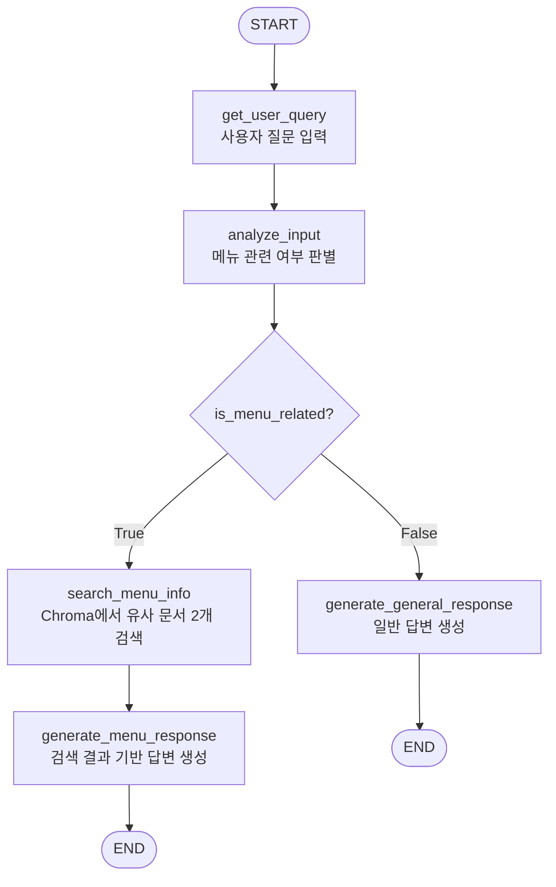
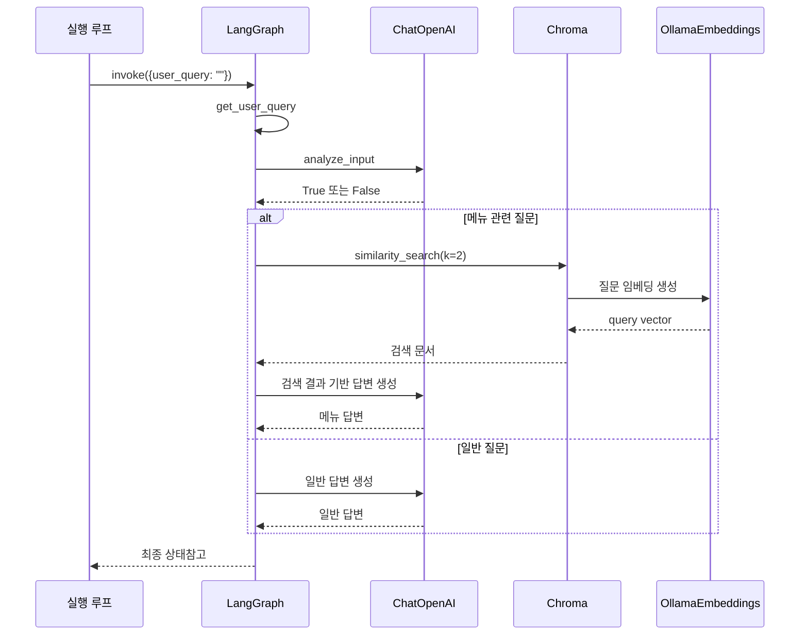
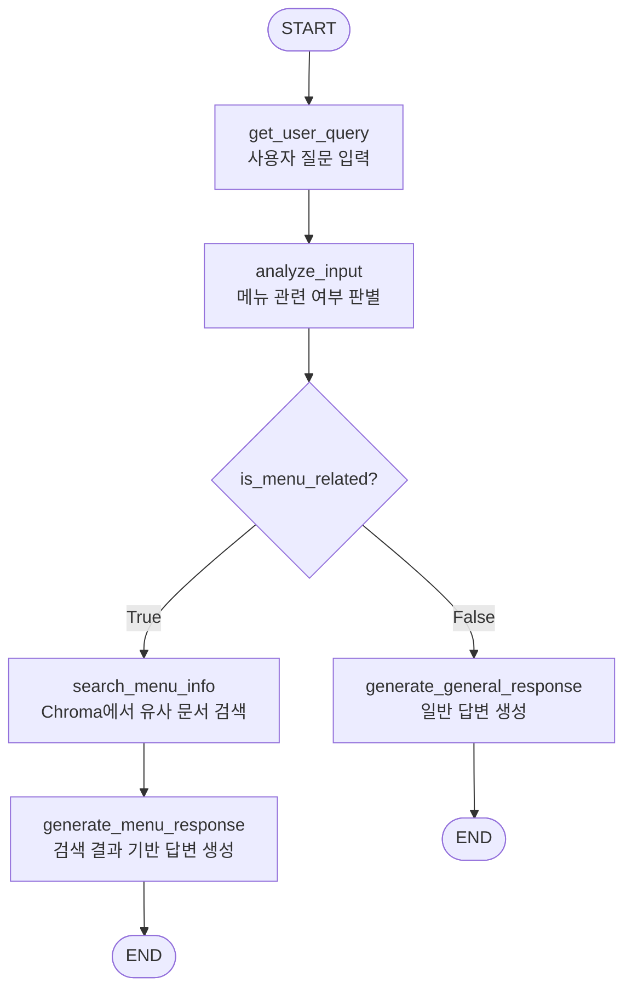

질문을 상태에 넣고, LLM으로 메뉴 관련 여부를 판별한 뒤에 조건부 Edge가 검색 RAG 경로와 일반 답변 경로 중 하나를 선택하는 그래프를 만들어 보자.

참고로 RAG를 사용하긴 하지만, 검색 결과를 다시 평가하거나 다시 쓰는 과정은 없기 때문에 Agentic RAG는 아니다.



## 1. 사전 준비

### 1.1. State 정의: 그래프가 공유하는 데이터 스키마

```python
from typing import List

class MenuState(TypedDict):
    user_query: str
    is_menu_related: bool
    search_results: List[str]
    final_answer: str
```

- `MenuState`는 노드 사이를 이동하는 데이터의 모양을 정의한다.

```python
return {"is_menu_related": is_menu_related}
```

- LangGraph의 노드는 전체 상태를 매번 새로 만들지 않고, 갱신한 부분만 덮어쓴다.
- 위 코드 기준 기존 값은 유지되고 `is_menu_related` 필드만 새로운 값으로 덮어씌워지게 된다.

### 1.2. 벡터 저장소 준비

```python
from langchain_chroma import Chroma
from langchain_ollama import OllamaEmbeddings

embeddings_model = OllamaEmbeddings(model="bge-m3")

vector_db = Chroma(
    embedding_function=embeddings_model,
    collection_name="restaurant_menu",
    persist_directory="./chroma_db",
)
```

- 검색을 실행하기 전에 기존 Chroma 컬렉션을 로드한다.
- [[Chroma로 RAG chain 구현]]에서 정의했던 Chroma를 재사용한다.
	- 이전에 이미 만들어둔 `./chroma_db`를 그래프에 연결하는 단계다.

```python
results = vector_db.similarity_search(state["user_query"], k=2)
search_results = [doc.page_content for doc in results]
return {"search_results": search_results}
```

- `k=2`를 통해 질문과 의미적으로 가까운 문서를 최대 2개 받도록 설정했다.

## 2. Node 설정하기

### 2.1. **사용자 입력 받는 노드**

```python
def get_user_query(state: MenuState) -> MenuState:
    user_query = input("무엇을 도와드릴까요? ")
    return {"user_query": user_query}
```

- 질문을 받은 뒤 `user_query`를 상태에 기록

### 2.2. LLM으로 Edge 라우팅 기준 판별하는 노드

```python
def analyze_input(state: MenuState) -> MenuState:
    analyze_template = """
    사용자의 입력을 분석하여 레스토랑 메뉴 추천이나 음식 정보에 관한 질문인지 판단하세요.
    사용자 입력: {user_query}
    메뉴나 음식 정보에 관한 질문이면 "True", 아니면 "False"로 답변하세요.
    """

    analyze_prompt = ChatPromptTemplate.from_template(analyze_template)
    analyze_chain = analyze_prompt | llm | StrOutputParser()

    result = analyze_chain.invoke({"user_query": state["user_query"]})
    is_menu_related = result.strip().lower() == "true"

    return {"is_menu_related": is_menu_related}
```

- 다음 작업 경로를 결정하기 위해 필요한 `is_menu_related` 상태값을 설정한다.
	- 템플릿에 판단하기 위한 쿼리를 넣은 채로 LCEL을 통해 `llm`에게 넘긴다.
	- 따라서 최종 판단은 `llm`이 수행한다.

### 2.3. 메뉴 질문에서만 실행되는 검색 노드

```python
def search_menu_info(state: MenuState) -> MenuState:
    results = vector_db.similarity_search(state["user_query"], k=2)
    search_results = [doc.page_content for doc in results]
    return {"search_results": search_results}
```

- 이 노드는 메뉴 관련 질문이 들어왔을 때만 실행된다.
- 검색 결과는 다음 답변을 생성하는 노드가 사용할 수 있도록 `search_results`에 담는다.

### **2.4 메뉴 질문에만 답변 생성하는 노드 (RAG)**

```python
def generate_menu_response(state: MenuState) -> MenuState:
    response_chain = response_prompt | llm | StrOutputParser()
    final_answer = response_chain.invoke({
        "user_query": state["user_query"],
        "search_results": state["search_results"],
    })
    print(f"\n메뉴 어시스턴트: {final_answer}")
    return {"final_answer": final_answer}
```

- 이 노드가 메뉴 질문에 대한 RAG라고 볼 수 있다.
	- 사용자 질문 + Chroma 검색 결과 → 프롬포트 → LLM이 답변 생성

### 2.5. 일반적인 질문에만 답변 생성하는 노드

```python
def generate_general_response(state: MenuState) -> MenuState:
    response_chain = response_prompt | llm | StrOutputParser()
    final_answer = response_chain.invoke({
        "user_query": state["user_query"],
    })
    print(f"\n일반 어시스턴트: {final_answer}")
    return {"final_answer": final_answer}
```

- 메뉴와 무관한 질문은 별도의 RAG 없이 바로 답변 노드로 이동한다.

## 3. Edge 설정하기

### 3.1. 분기용 라우터 정의하기

```python
from typing import Literal

def decide_next_step(
    state: MenuState,) -> Literal["search_menu_info", "generate_general_response"]:
    if state["is_menu_related"]:
        return "search_menu_info"
    else:
        return "generate_general_response"
```

- Edge나 Node가 아니다. 단지 결과에 따라 Node 이름을 반환하는 라우터다.

## 4. Graph 구성하기 (Node + Edge 합치기)

### 4.1. 그래프에 Node 추가하기

```python
from langgraph.graph import StateGraph, START, END

builder = StateGraph(MenuState)

builder.add_node("get_user_query", get_user_query)
builder.add_node("analyze_input", analyze_input)
builder.add_node("search_menu_info", search_menu_info)
builder.add_node("generate_menu_response", generate_menu_response)
builder.add_node("generate_general_response", generate_general_response)
```

- 우선 `MenuState`를 사용하는 그래프 빌더를 먼저 만든 뒤에 노드를 추가한다.

### 4.2. 그래프에 고정 Edge 추가하기

```python
builder.add_edge(START, "get_user_query")
builder.add_edge("get_user_query", "analyze_input")

builder.add_edge("search_menu_info", "generate_menu_response")
builder.add_edge("generate_menu_response", END)
builder.add_edge("generate_general_response", END)
```

- 그래프에서 노드끼리 고정 경로인 경우에는 `.add_edge(출발, 도착)`를 통해 연결한다.

### 4.3. 그래프에 조건부 Edge 추가하기

```python
builder.add_conditional_edges(
    "analyze_input",
    decide_next_step,
    {
        "search_menu_info": "search_menu_info",
        "generate_general_response": "generate_general_response",
    },
)
```

- `analyze_input` 실행이 끝나면 현재 상태를 `decide_next_step`에 전달한다.
- 라우터에게 전달된 문자열과 매핑된 노드를 찾고, 해당 노드부터 그래프 실행을 계속한다.

### 4.4. 그래프를 실행 가능한 Runnable로 만들기

```python
graph = builder.compile()
```

- `compile()`은 지금 당장 질문을 처리하는 호출이 아니다.
	- 정의한 상태 스키마, 노드, 엣지를 실행 가능한 객체로 묶는 단계다.

## 5. invoke와 대화를 통해 그래프 실행하기

```python
while True:
    initial_state = {"user_query": ""}
    graph.invoke(initial_state)

    continue_chat = input("다른 질문이 있으신가요? (y/n): ").lower()
    if continue_chat != "y":
        print("대화를 종료합니다. 감사합니다!")
        break
```

### 5.1. invoke를 한 번 실행할 때의 실행 루프



### 5.2. RAG도 되는 그래프인데, 그럼 Agentic RAG인가?

일반적인 Agentic과 다르게 이번에 구현한 그래프는 여러 도구 중 동적으로 선택하는 것이 아닌 메뉴 관련 여부로 2분기만 존재한다. 아래의 순서도를 보면 검색 횟수도 1회 고정되어 있고, 문서 관련성 평가, 질문 재작성, 재검색•재생성 루프도 없어서 Agentic RAG보다는 단순한 LLM 기반 조건부 라우팅 RAG라고 보는 것이 더 마땅함.



## 참고

[[Chroma로 RAG chain 구현]]

[[StateGraph 핵심 구성 요소 (State, Node, Edge)]]