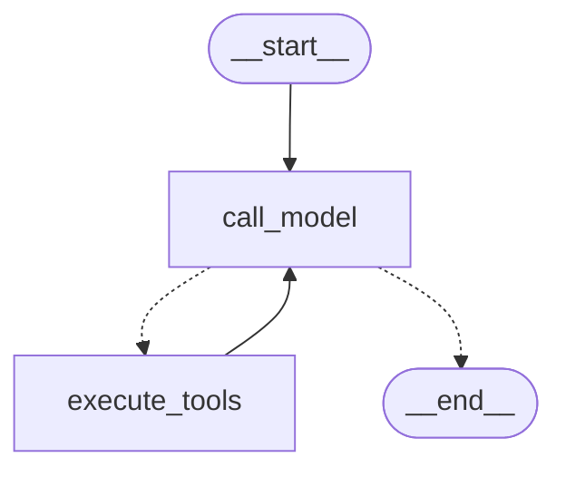

기존에 LangGraph에서 제공하던 ReAct Agent 그래프가 있지만, 구조적으로 고정된 부분이 있어서 내가 원하는대로 커스텀이 불가능했다. 그래서 이번에는 StateGraph를 통해 실제로 ReAct 구조를 만들어 보자.

## 1. StateGraph로 ReAct 그래프 만들기

```python
from langgraph.graph import MessagesState, StateGraph, START, END
from langchain_core.messages import HumanMessage, SystemMessage
from langgraph.prebuilt import ToolNode
from IPython.display import Image, display

# LangGraph MessagesState 사용
class GraphState(MessagesState):
    pass

# 노드 구성 
def call_model(state: GraphState):
    system_message = SystemMessage(content=system_prompt)
    messages = [system_message] + state['messages']
    response = llm_with_tools.invoke(messages)
    return {"messages": [response]}

def should_continue(state: GraphState):
    last_message = state["messages"][-1]
    # 도구 호출이 있으면 도구 실행 노드로 이동
    if last_message.tool_calls:
        return "execute_tools"
    # 도구 호출이 없으면 답변 생성하고 종료 
    return END

# 그래프 구성
builder = StateGraph(GraphState)
builder.add_node("call_model", call_model)
builder.add_node("execute_tools", ToolNode(tools))

builder.add_edge(START, "call_model")
builder.add_conditional_edges(
    "call_model", 
    should_continue,
    {
        "execute_tools": "execute_tools",
        END: END
    }
)
# 피드백 루프 구현
builder.add_edge("execute_tools", "call_model")

graph = builder.compile()

# 그래프 출력 
display(Image(graph.get_graph().draw_mermaid_png()))
```



- `class GraphState(MessagesState):`
	- `MessagesState` → 기본적으로 메시지들이 `“messages”`에 관리된다.
- `call_model` 노드 (기존 ReAct 구조의 agent 역할)
	- `system_message = SystemMessage(content=system_prompt)`
		- `SystemMessage`를 통해 LLM이 지켜야 할 프롬포트를 전달한다.
	- `messages = [system_message] + state['messages']`
		- `SystemMessage`에 지금까지 쌓인 메시지를 더한다.
	- `response = llm_with_tools.invoke(messages)`
		- 이 전체 대화를 LLM에게 전달한다.
	- `return {"messages": [response]}`
		- LLM이 만든 응답을 `messages`에 추가한다.  
			→ [[MessagesState]]의 [[State Reducer]] 덕분
- `should_continue`
	- 가장 최근의 `AIMessage`를 가지고 도구를 호출해야 하는지 판별
	- 결과에 따라 [[ToolNode]]로 가거나 `END` 처리
	- 참고로 이 부분은 [[tools_condition]]으로 더 쉽게 구현 가능하다.
- `builder.add_node("execute_tools", ToolNode(tools))`
	- [[ToolNode]]를 통해 LLM이 요청한 도구를 실행하는 노드 등록
	- `ToolNode`와 같은 노드의 실행은 나중에 컴파일된 graph가 알아서 함.
	- 정확히는 LangGraph의 실행 엔진이 수행함.
- `builder.add_edge("execute_tools", "call_model")`
	- [[Feedback Loop Chain]]까지 완벽하게 구현했다.

```python
# 그래프 실행
inputs = {"messages": [HumanMessage(content="스테이크 메뉴의 가격은 얼마인가요?")]}
messages = graph.invoke(inputs)
for m in messages['messages']:
    m.pretty_print()
```

```
================================ Human Message =================================

스테이크 메뉴의 가격은 얼마인가요?
================================== Ai Message ==================================
Tool Calls:
  search_menu (call_YupcoXUOWQlNIwf3GhZ1V1g7)
 Call ID: call_YupcoXUOWQlNIwf3GhZ1V1g7
  Args:
    query: 스테이크
================================= Tool Message =================================
Name: search_menu

<Document source="./data/restaurant_menu.txt"/>
1. 시그니처 스테이크
   • 가격: ₩35,000
   • 주요 식재료: 최상급 한우 등심, 로즈메리 감자, 그릴드 아스파라거스
   • 설명: 셰프의 특제 시그니처 메뉴로, 21일간 건조 숙성한 최상급 한우 등심을 사용합니다. 미디엄 레어로 조리하여 육즙을 최대한 보존하며, 로즈메리 향의 감자와 아삭한 그릴드 아스파라거스가 곁들여집니다. 레드와인 소스와 함께 제공되어 풍부한 맛을 더합니다.
</Document>

---

<Document source="./data/restaurant_menu.txt"/>
8. 안심 스테이크 샐러드
   • 가격: ₩26,000
   • 주요 식재료: 소고기 안심, 루꼴라, 체리 토마토, 발사믹 글레이즈
...
   - 주요 식재료: 소고기 안심, 루꼴라, 체리 토마토, 발사믹 글레이즈
   - 설명: 부드러운 안심 스테이크를 얇게 슬라이스하여 신선한 루꼴라 위에 올린 메인 요리 샐러드입니다.

이 정보는 레스토랑 메뉴에서 확인한 내용입니다. [Source: search_menu | 스테이크 | ./data/restaurant_menu.txt]
Output is truncated. View as a scrollable element or open in a text editor. Adjust cell output settings...
```