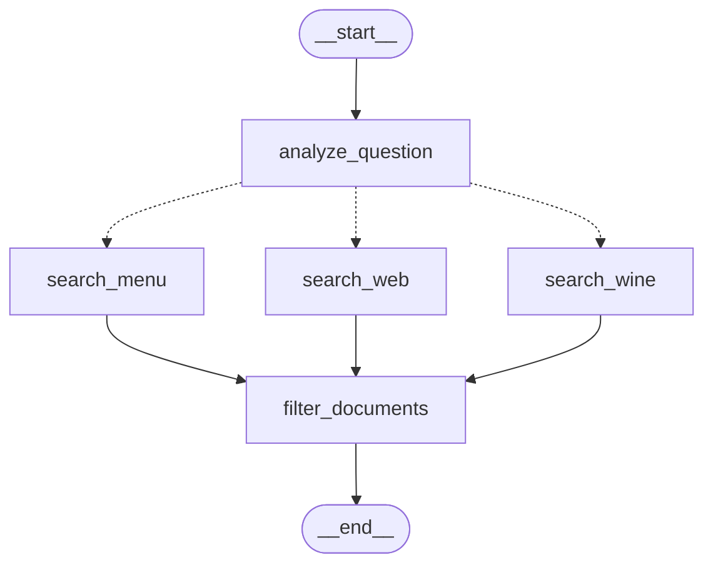
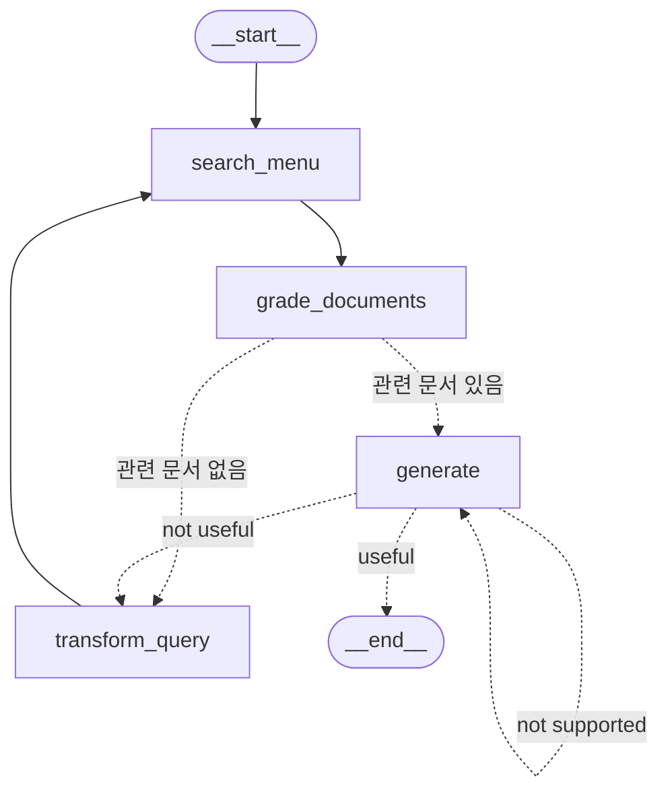
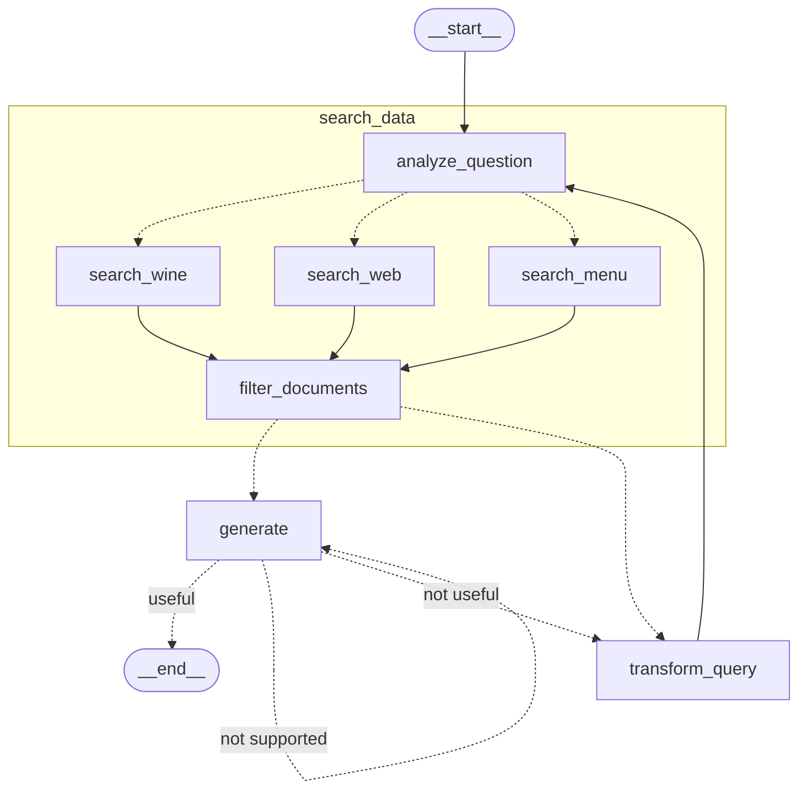

SubGraph는 하나의 Graph 내부에 포함되어 있는 또 다른 Graph다. 기능별로 작은 Graph로 나눈 뒤 조합하는 방식으로 사용된다. 다중 에이전트 시스템이나 복잡한 의사결정 프로세스를 구현할 때도 모듈화를 통해 구현할 수 있다.

## SubGraph 활용 예시

[[Self-RAG]]에서 만든 그래프에서 문서를 검색하는 쪽의 기능을 강화하기 위해서 [[Adaptive RAG]]에서 구현한 검색 그래프를 반영해 보자.

이런 형태의 Adaptive RAG 그래프를 준비했다. [[Adaptive RAG]]에서 구현한 그래프에서 검색 방법을 3개로 늘렸다.

[[Self-RAG]]에서 만든 그래프의 모습이다. 여기서 문서를 찾는 `search_menu` 자리에 위에 그래프를 서브그래프로 넣으면 된다.

Adaptive RAG 그래프가 서브그래프로 Self-RAG 그래프 안에 들어간 것을 볼 수 있다. 의도했던 대로 Self-RAG 그래프의 검색 엔진이 쉽게 강화된 것을 볼 수 있다.

이렇게 서브그래프를 통해 특정 기능을 모듈화하여 쉽게 탈부착이 가능하다는 것이 서브그래프의 장점이다.