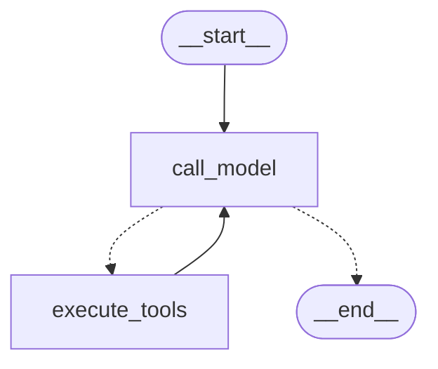

LangGraph에서 제공하는 도구 사용을 위한 조건부 Edge 함수(라우터)다. 최신 메시지(`AIMessage`)가 도구 호출이면 `tools_condition`이 도구로 라우팅, 도구 호출이 아니라 일반 메시지인 경우에는 END로 알아서 라우팅해 준다.

```python
# 분기 라우팅 함수
def should_continue(state: GraphState):
    last_message = state["messages"][-1]
    # 도구 호출이 있으면 도구 실행 노드로 이동
    if last_message.tool_calls:
        return "execute_tools"
    # 도구 호출이 없으면 답변 생성하고 종료 
    return END

# 분기 Edge 설정
builder.add_conditional_edges(
    "call_model", 
    should_continue,
    {
        "execute_tools": "execute_tools",
        END: END
    }
)
```

- [[StateGraph를 통한 ReAct Agent 그래프 구현]]에서 사용한 코드다.



- `call_model`의 결과에 따라 분기를 담당하는 라우터를 담당하는 부분이다.

```python
from langgraph.prebuilt import tools_condition

# 분기 라우팅 함수
def should_continue(state: GraphState):
    last_message = state["messages"][-1]
    # 도구 호출이 있으면 도구 실행 노드로 이동
    if last_message.tool_calls:
        return "execute_tools"
    # 도구 호출이 없으면 답변 생성하고 종료 
    return END
    
# 일반 조건부 Edge 라우터를 사용한 경우
builder.add_conditional_edges(
    "call_model", 
    should_continue,
    {
        "execute_tools": "execute_tools",
        END: END
    }
)

# tools_condition을 사용한 경우 (훨씬 간단)
builder.add_conditional_edges(
    "call_model",
    tools_condition,
)
```

- 이렇게 호출하면 도구 호출 결과에 따라 라우팅을 처리해 준다.
	- 별도의 `should_continue`같은 라우팅 함수를 직접 짤 필요가 없다.
- 실행 순서 요약
	- `call_model`에서 LLM이 도구가 A, B, C가 필요하다고 판단
	- `AIMessage` 형태를 보고 `tool_condition`이 `ToolNode`로 분기
	- `ToolNode`에서 A, B, C 병렬 실행하게 됨.